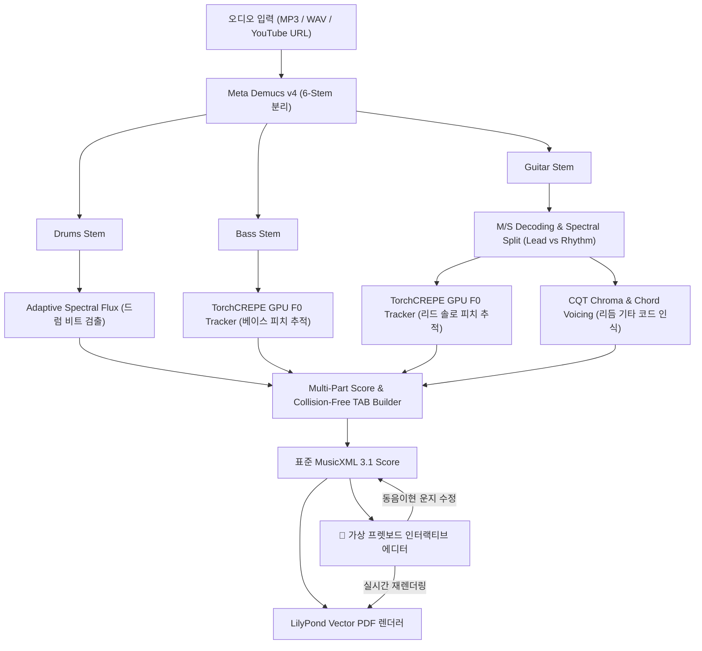

# 🎸 AI Band Transcriber & Interactive Fretboard TAB Editor

<div align="center">

[](https://www.python.org/)
[](https://pytorch.org/)
[](https://github.com/facebookresearch/demucs)
[](https://github.com/maxrmorrison/torchcrepe)
[](https://github.com/TomSchimansky/CustomTkinter)
[](LICENSE)

**음악 파일(MP3/WAV/FLAC) 및 유튜브 링크를 입력받아 AI로 밴드 악기(드럼, 베이스, 리듬/리드 기타)를 분리하고, 고정밀 타브(TAB) 악보 및 MusicXML/PDF를 자동 생성하며, 가상 프렛보드에서 동음이현 대안 운지를 실시간으로 수정할 수 있는 All-in-One 로컬 데스크톱 애플리케이션입니다.**

An end-to-end AI music transcription suite that isolates band instruments (Drums, Bass, Rhythm/Lead Guitar) from audio or YouTube, performs SOTA pitch and chord recognition, exports professional MusicXML & PDF TAB scores, and provides an interactive virtual fretboard editor for alternate fingering adjustments.

</div>

---

## 📸 스크린샷 (Screenshots)

### 1. 세련된 다크모드 GUI & 올인원 워크플로우
> 반응형 스크롤 레이아웃과 도킹 컨트롤러를 지원하며, 원클릭으로 악보 분리, MuseScore 연동, PDF 뷰어, 타브 운지 수정기를 실행할 수 있습니다.

<div align="center">
  
</div>

---

### 2. 고정밀 기타/베이스 타브(TAB) 악보 자동 생성 결과
> TorchCREPE GPU 피치 추적과 CQT 코드 인식을 통해 옥타브 점핑 없이 정밀하게 채보된 실제 악보 (LilyPond 벡터 PDF 렌더링).

<div align="center">
  
</div>

---

### 3. 인터랙티브 가상 프렛보드 운지 편집기 (Alternative Fingering Editor)
> 22프렛 가상 프렛보드에서 선택한 음표의 **동음이현(동일한 음이 나는 다른 줄과 프렛)** 위치를 실시간으로 탐색하고 클릭 한 번으로 운지를 교체하여 즉시 PDF로 재출력할 수 있습니다.

<div align="center">
  
</div>

---

## 🌟 주요 특징 (Key Features)

### 1. 🎧 Meta Demucs v4 기반 6-Stem 고속 음원 분리
- 보컬, 드럼, 베이스, 기타, 피아노, 기타 배킹 트랙을 GPU(CUDA) 가속으로 고음질 분리.
- Mid-Side(M/S) 디코딩 및 스펙트럴 분리를 통해 센터 솔로(Lead Guitar)와 스테레오 더블트래킹 백킹(Rhythm Guitar)을 정밀하게 개별 분리.

### 2. 🧠 SOTA TorchCREPE GPU 피치 추적 & CQT 코드 인식 (Plan A 엔진)
- **TorchCREPE 심층 신경망**: 360-bin Viterbi 디코딩으로 저음역(베이스) 및 고음역(기타 솔로)의 옥타브 건너뜀(Octave Jump)과 고스트 노트를 완벽 차단.
- **CQT Chroma 기타 코드 인식**: 리듬 기타 트랙의 CQT 스펙트로그램으로부터 표준 6현 기타 코드 보이싱(Open/Barre Voicing)을 자동 매핑.
- **충돌 방지(Collision-free) 현 할당**: 화음 구성음 간 동일 줄 충돌을 자동 회피하여 실제 연주 가능한 타브 운지 계산.

### 3. 🎸 실시간 인터랙티브 프렛보드 에디터 (`src/fretboard_gui.py`)
- **22프렛 가상 기타/베이스 지판 제공**: 마디 및 음표 선택 시 지판 위에 현재 위치 및 모든 대안 운지(동음이현)가 하이라이트.
- **클릭 한 번으로 운지 변경**: 연주하기 불편한 포지션을 원하는 현/프렛으로 즉시 수정.
- **MusicXML DOM 수정 및 즉각적인 LilyPond PDF 재출력 지원**: 별도의 외부 편집기 없이 자체 엔진에서 바로 반영.

### 4. 📄 무결점 MusicXML & 벡터 PDF 자동 출력
- **MuseScore 4 / Guitar Pro / TuxGuitar 호환**: 표준 MusicXML 3.1 포맷 지원.
- **LilyPond 내장 변환 엔진**: 복잡한 타브 표기 및 쉼표(Rest) 정규화를 거쳐 인쇄 품질의 고해상도 벡터 PDF 자동 생성.

### 5. 🖥️ 간편한 Windows 데스크톱 경험
- **경량 런처 (`AI_Band_Transcriber.exe`)**: C# 네이티브 래퍼로 콘솔창 깜빡임 없이 즉시 실행.
- **유튜브 링크 직접 지원**: URL 입력만으로 `yt-dlp`가 고음질 오디오를 자동 다운로드하여 파이프라인 직행.
- **파트 선택 출력**: 드럼 / 베이스 / 리듬 기타 / 리드 기타 중 필요한 파트만 선별하여 악보 제작 가능.

---

## 🔄 시스템 아키텍처 (System Architecture)



---

## 💻 요구 사양 (System Requirements)

- **OS**: Windows 10 / 11 (64-bit)
- **GPU**: NVIDIA 그래픽카드 (CUDA 11.8 또는 12.x 이상 권장, VRAM 4GB 이상 권장)
  - *CPU 전용 모드로도 구동 가능하지만 GPU 환경에서 5~10배 이상 빠릅니다.*
- **Python**: Python 3.10 또는 3.11
- **외부 툴 (선택 권장)**:
  - [LilyPond](https://lilypond.org/): 고품질 PDF 타브 악보를 직접 렌더링할 때 사용.
  - [MuseScore 4](https://musescore.org/): 생성된 MusicXML 악보 열람 및 실시간 연주 재생.

---

## 🚀 설치 및 실행 방법 (Quick Start)

### 1. 저장소 복제 (Clone Repository)
```bash
git clone https://github.com/ManofKimchi08/ai-guitar-transcriber.git
cd ai-guitar-transcriber
```

### 2. 가상환경 구성 및 패키지 설치
```bash
# 가상환경 생성
python -m venv venv
venv\Scripts\activate

# PyTorch (CUDA 지원 버전 권장)
pip install torch torchaudio --index-url https://download.pytorch.org/whl/cu124

# 필수 의존성 라이브러리 일괄 설치
pip install -r requirements.txt
```

### 3. 프로그램 실행

#### 방법 1: 원클릭 실행 (Windows 추천)
- `AI_Band_Transcriber.exe` 또는 `run_gui.bat` 파일을 더블 클릭합니다.

#### 방법 2: 파이썬 직접 실행
```bash
python app_gui.py
```

#### 방법 3: CLI 명령행 배치 변환
```bash
python main.py -i "input_song.mp3" -o "output" --style tab
```

---

## 📁 프로젝트 구조 (Repository Structure)

```
ai_band_transcriber/
├── app_gui.py                 # CustomTkinter 반응형 다크모드 메인 GUI
├── main.py                    # CLI 파이프라인 진입점
├── AI_Band_Transcriber.exe    # Windows 원클릭 실행 런처
├── Launcher.cs                # 런처 C# 소스 코드
├── run_gui.bat                # 가상환경 자동 로딩 배치 스크립트
├── requirements.txt           # Python 라이브러리 목록
│
├── src/                       # 핵심 오디오 분석 및 채보 엔진
│   ├── separator.py           # Meta Demucs 6-stem 음원 분리
│   ├── guitar_splitter.py     # M/S 기반 Lead / Rhythm 기타 분리
│   ├── pitch_transcriber.py   # TorchCREPE GPU 고정밀 F0 피치 트래커
│   ├── chord_recognizer.py    # CQT 크로마 기반 기타 코드 인식기
│   ├── drum_transcriber.py    # 스펙트럴 플럭스 드럼 트랜스크라이버
│   ├── tab_builder.py         # 충돌 회피 알고리즘 기반 타브 악보 빌더
│   ├── fretboard_editor.py    # MusicXML DOM 운지 변경 및 동음이현 탐색기
│   ├── fretboard_gui.py       # 22프렛 가상 프렛보드 인터랙티브 GUI
│   └── pdf_exporter.py        # MusicXML to LilyPond / PDF 익스포터
│
├── docs/                      # 문서 및 스크린샷 에셋
│   └── images/
│       ├── gui_main.png
│       ├── tab_score_preview.png
│       └── fretboard_editor.png
│
└── tests/                     # 단위 테스트 및 검증 스크립트
```

---

## 🏷️ GitHub Topics / Tags

`ai-transcription`, `guitar-tab`, `torchcrepe`, `demucs`, `chord-recognition`, `fretboard-editor`, `musicxml`, `lilypond`, `musescore`, `customtkinter`, `pytorch`, `audio-to-tab`

---

## 📄 라이선스 (License)

본 프로젝트는 MIT License를 따릅니다. 세부 사항은 [LICENSE](LICENSE) 파일을 참조하십시오.
