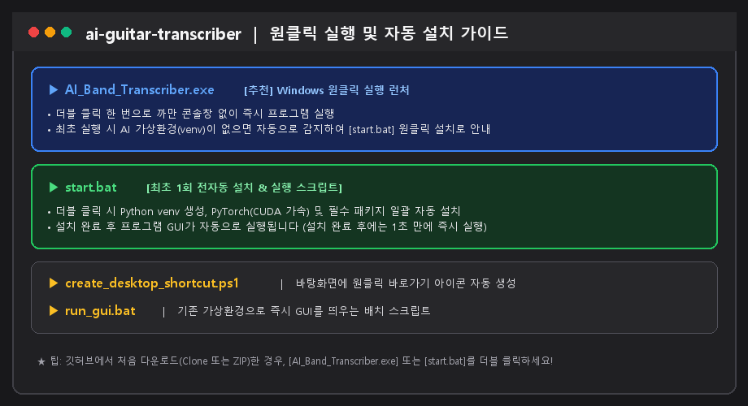
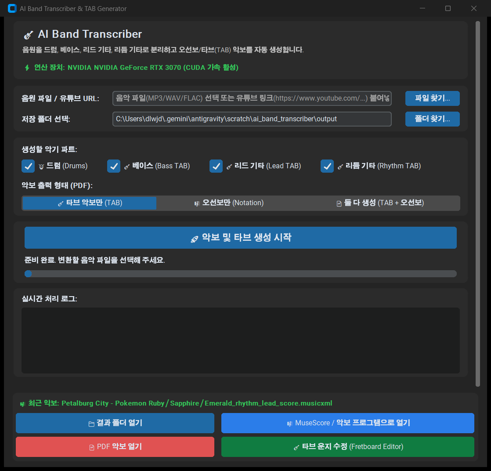
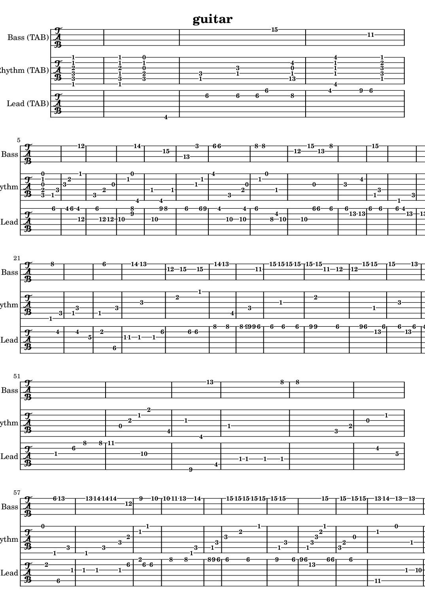
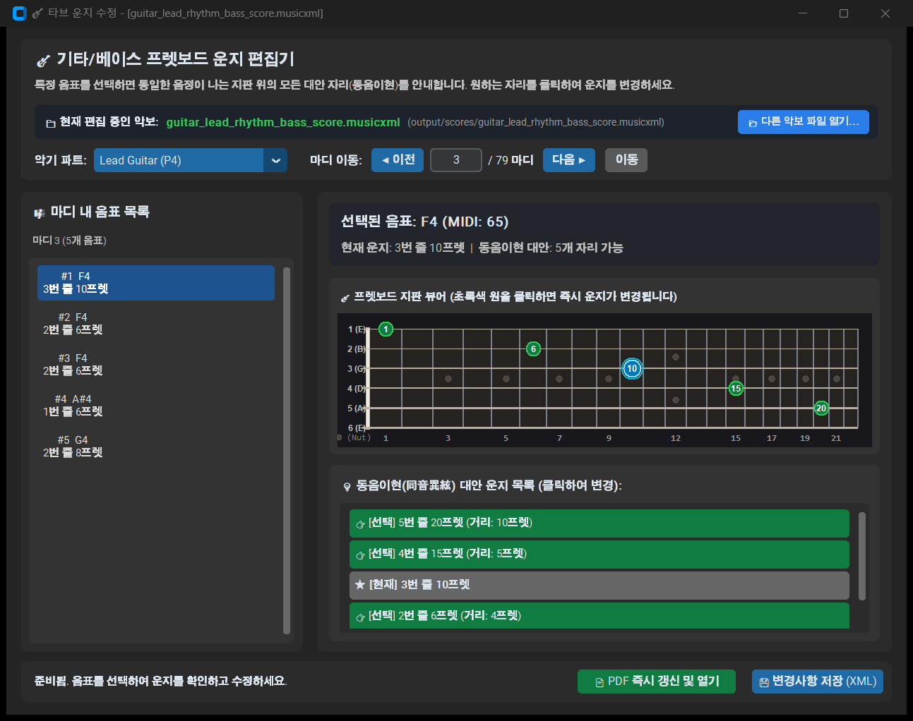
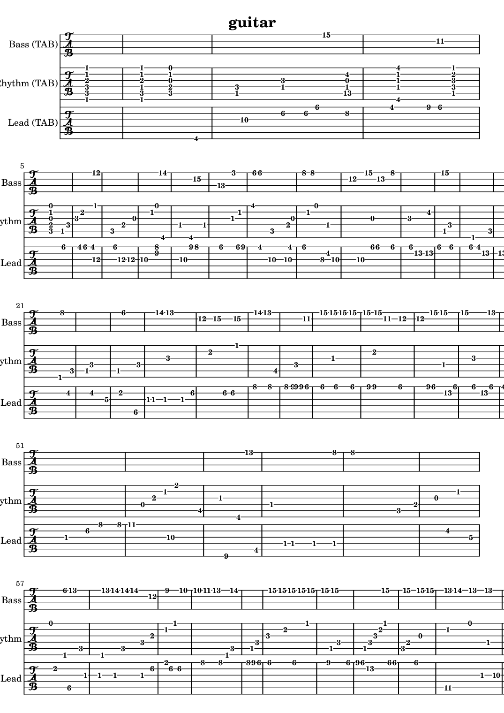

# 🎸 AI Band Transcriber & Interactive Fretboard TAB Editor

<div align="center">

[](https://www.python.org/)
[](https://pytorch.org/)
[](https://github.com/facebookresearch/demucs)
[](https://github.com/maxrmorrison/torchcrepe)
[](https://github.com/TomSchimansky/CustomTkinter)
[](LICENSE)

**음악 파일(MP3/WAV/FLAC) 및 유튜브 링크를 입력받아 AI로 밴드 악기(드럼, 베이스, 리듬/리드 기타)를 분리하고, 고정밀 타브(TAB) 악보 및 MusicXML/PDF를 자동 생성하며, 가상 프렛보드에서 동음이현 대안 운지를 실시간으로 수정할 수 있는 All-in-One 로컬 데스크톱 애플리케이션입니다.**

An end-to-end AI music transcription suite that isolates band instruments (Drums, Bass, Rhythm/Lead Guitar) from audio or YouTube, performs SOTA pitch and chord recognition, exports professional MusicXML & PDF TAB scores, and provides an interactive virtual fretboard editor for alternate fingering adjustments.

</div>

---

## ⚡ 빠른 시작: 원클릭 자동 설치 & 실행 (Windows 추천 ⭐)

새로 프로그램을 다운로드받은 사용자분들도 복잡한 명령어를 칠 필요 없이 **더블 클릭 한 번으로 모든 설치와 실행이 완료**됩니다.

<div align="center">
  
</div>

### 🎯 실행 방법 2가지 중 편한 것을 선택하세요:

1. **`AI_Band_Transcriber.exe` 더블 클릭 (⭐ 가장 추천)**:
   - 까만 콘솔창 없이 즉시 GUI를 띄워주는 C# 네이티브 런처입니다.
   - 만약 최초 실행하여 AI 가상환경(`venv`)이 설치되어 있지 않다면, **"최초 1회 자동 설치를 진행하시겠습니까?"** 안내 창이 뜨며 `[확인]` 클릭 시 자동으로 설치 창으로 연결됩니다.
2. **`start.bat` 더블 클릭**:
   - 가상환경 생성, PyTorch(CUDA 12.4 가속) 및 필수 패키지 일괄 설치를 **전자동으로 완료한 후 프로그램을 바로 띄워줍니다.** (설치 완료 후 다음부터는 1초 만에 즉시 실행됩니다.)

---

## 📸 주요 화면 및 기능 미리보기 (Screenshots)

### 1. 올인원 반응형 다크모드 GUI & 최근 악보 자동 복원
> 4개 악기 파트(드럼/베이스/리드기타/리듬기타) 선별 추출, 타브 악보 스타일 선택, 도킹 컨트롤러를 지원합니다. 프로그램을 껐다 켜더라도 이전에 작업한 최근 악보를 즉시 감지하여 하단 버튼이 자동으로 활성화됩니다.

<div align="center">
  
</div>

---

### 2. 고정밀 기타/베이스 타브(TAB) 악보 자동 생성 결과
> TorchCREPE GPU 피치 추적과 CQT 코드 인식을 통해 옥타브 점핑 없이 정밀하게 채보된 실제 악보 (LilyPond 벡터 PDF 렌더링).

<div align="center">
  
</div>

---

### 3. 인터랙티브 가상 프렛보드 운지 편집기 (Alternative Fingering Editor)
> 22프렛 가상 프렛보드에서 선택한 음표의 **동음이현(동일한 음이 나는 다른 줄과 프렛)** 위치를 실시간으로 탐색하고 클릭 한 번으로 운지를 교체하여 즉시 PDF로 재출력할 수 있습니다. (재출력 시 이전 구버전 PDF 삭제 또는 백업 보존 선택 가능)

<div align="center">
  
</div>

---

### 4. 운지 수정 후 즉시 갱신된 타브 악보 (Edited Score Preview)
> 가상 프렛보드에서 원하는 대안 운지를 클릭하여 즉시 재출력된 최신 악보. 이전 구버전 악보와의 충돌 없이 깔끔하게 갱신됩니다.

<div align="center">
  
</div>

---

## 📝 최신 업데이트 내역 (Release Notes & Changelog)

### 🏷️ Version 1.2.0 (2026-10-04) - 안정화 및 음질/악보 정밀도 대폭 향상

> **태그 (Tags):** `v1.2.0`, `sota-accuracy`, `batch-fix`, `chord-voicings`, `musicxml-fix`, `crepe-full`

이번 업데이트는 초보자 설치 안정성, 7th 코드 화음 인식률, MusicXML 규격 준수, 그리고 인공지능 피치 추적 해상도를 획기적으로 개선한 메이저 업데이트입니다.

#### 1. 🚀 `start.bat` 원클릭 배치 스크립트 전면 개편
- **Cmd 문법 구문 오류 완벽 해결**: 윈도우 `cmd.exe`에서 `if (...)` 괄호 블록 내 괄호/특수기호로 인한 조기 종료 및 syntax error를 제거하고 안정적인 라벨 점프(`goto`) 구조로 재설계.
- **CRLF 개행 및 인코딩 무결성**: `.gitattributes` 도입으로 Git 체크아웃 시 항상 윈도우 표준 CRLF 개행을 유지하도록 보장.
- **초고속 재실행 보장**: 가상환경과 PyTorch 의존성이 정상 완료되면 `venv\.installed` 플래그를 생성하여, 재실행 시 무의미한 재설치 검사를 건너뛰고 1초 만에 GUI를 실행.

#### 2. 🎸 리듬 기타 7th 코드 보이싱 전체 확장 (48개 템플릿 100% 매핑)
- 기존 누락되어 있던 **C#7, D#7, F#7, G#7, A#7** 등 도미넌트 7th 코드 보이싱 템플릿을 전격 추가.
- 이제 12개 모든 반음계의 메이저(Major), 마이너(Minor), 세븐스(7th), 파워코드(5) 총 48개 코드 템플릿이 6현 타브 지판에 빠짐없이 정확한 운지로 자동 채보됩니다.

#### 3. 🎼 MusicXML 4/4 박자 마디 누적 오버플로우 차단 및 음표 `<type>` 표준 태그 도입
- **마디 박자 정밀 퀀타이즈**: 4분음표당 24디비전(32분음표와 셋잇단 16분음표가 모두 들어가는 격자)으로, 마디 길이를 넘지 않도록 음표 길이를 다음 슬롯까지로 엄격히 바운딩.
- **표준 쉼표 분할 알고리즘**: 빈 공간을 박 경계에 맞춘 쉼표(32분 → 16분 → 8분 → 4분 → 2분)로 나눠, 다음 박까지 채운 뒤 큰 단위로 이어지게 배치. 빈 마디는 마디 전체 쉼표 하나.
- **표준 `<type>` 태그 탑재**: MuseScore 4, TuxGuitar, Guitar Pro 등 모든 상용 악보 뷰어에서 경고 없이 완벽하게 음표 머리가 렌더링되도록 `<type>` (`whole`, `half`, `quarter`, `eighth`, `16th`) 및 `<dot/>` 태그를 완벽하게 생성.

#### 4. 🧠 SOTA TorchCREPE `full` 모델 적용 & 리드 기타 중저역 주파수 완벽 보존
- **TorchCREPE 최고 사양 360-bin 모델 탑재**: 기존 `tiny` 모델에서 가장 높은 노이즈 억제력과 피치 정밀도를 지닌 `full` 모델을 기본 탑재.
- **리드 기타 하이패스 필터 개선**: 기존 420Hz 고역 통과 필터로 인해 E2~G4(82Hz~392Hz) 대역의 기타 솔로/리프 음표가 손실되던 문제를 해결하고, 80Hz 럼블 필터로 교체하여 기타 전 음역대를 온전히 트랜스크라이브.

#### 5. 📄 LilyPond 동적 자동 탐색 및 스마트 PDF 버전 관리 지원
- 하드코딩된 특정 사용자 폴더 경로를 완전히 제거하고, `shutil.which` 및 WinGet / Program Files 디렉터리 동적 글롭 탐색 엔진으로 어느 PC에서나 LilyPond가 자동 감지되도록 구현.
- 가상 프렛보드에서 악보 수정 시, 현재 활성화된 악보 스타일(`_TAB.pdf`, `_TAB_Score.pdf`, `.pdf`)을 정확히 타겟팅하여 이전 PDF 삭제 또는 타임스탬프 백업(`_backup.pdf`)을 사용자 선택에 따라 안전하게 처리.

---

## 🌟 핵심 기능 요약 (Key Features)

### 1. 🎧 Meta Demucs v4 기반 6-Stem 고속 음원 분리
- 보컬, 드럼, 베이스, 기타, 피아노, 기타 배킹 트랙을 GPU(CUDA) 가속으로 고음질 분리.
- **리드/리듬 기타 분리 (스테레오 위치)**: 시간-주파수 칸마다 좌우 채널이 얼마나 같은지를 비교해, 가운데에 있는 소리(보통 솔로)는 리드 기타로, 좌우로 벌려 녹음한 더블트래킹 백킹은 리듬 기타로 나눕니다. 예전 Mid-Side 방식은 리드 트랙에 리듬 기타 절반이 그대로 섞였습니다 (합성 믹스 기준 리드 멜로디 채보 정확도 0% → 53~78%).
  - 두 리듬 테이크가 순간적으로 위상이 맞아 '가운데 소리'처럼 보이는 것은, 0.4초 동안 계속 가운데인지도 함께 따져 걸러냅니다. 리듬 기타를 ±60%만 벌린 믹스도 나뉩니다.
  - 리듬 기타 한 대가 가운데, 솔로가 한쪽에 있는 믹스는 코드를 치는 쪽을 리듬으로 자동 판별합니다.
  - 기타가 모노로 녹음된 곡은 위치로 나눌 수 없어 리드·리듬 모두 기타 전체로 채보하고, 리드 없이 리듬 기타만 좌우에 있으면 리드는 건너뜁니다.
  - 코드 인식은 좌우 채널을 따로 분석해 더하므로, 음정이 조금씩 다른 두 테이크가 섞이며 3음이 상쇄돼 F를 F5로 읽는 일이 줄었습니다.
  - 한계: 리드가 가운데에서 25% 이상 치우치거나 리듬 기타가 가운데 가까이 있으면 잘 나뉘지 않고, 리듬 기타를 ±60%만 벌린 곡은 리드가 없어도 리드 파트가 생길 수 있습니다.

### 2. 🧠 SOTA TorchCREPE GPU 피치 추적 & CQT 코드 인식 (Plan A 엔진)
- **TorchCREPE 심층 신경망**: 360-bin Viterbi 디코딩으로 저음역(베이스) 및 고음역(기타 솔로)의 옥타브 건너뜀(Octave Jump)과 고스트 노트를 완벽 차단.
- **CQT Chroma 기타 코드 인식**: 리듬 기타 트랙의 CQT 스펙트로그램으로부터 표준 6현 기타 코드 보이싱(Open/Barre Voicing)을 자동 매핑.
- **충돌 방지(Collision-free) 현 할당**: 화음 구성음 간 동일 줄 충돌을 자동 회피하여 실제 연주 가능한 타브 운지 계산.
- **드럼 분류**: 주파수 대역별 어택(음량이 급히 오르는 순간)으로 킥·스네어·클로즈/오픈 하이햇·크래시를 구분합니다. 약하게 친 타격도 잡고, 울리는 심벌 아래의 스네어·하이햇, 다른 악기 소리가 섞인 경우도 견딥니다 (합성 비트 기준 F1 0.99, 타이밍 오차 ±20ms 이내). 크래시가 울리는 동안의 하이햇은 고음 대역만 따로 오른 것만 인정해, 크래시 소리의 일렁임을 하이햇으로 착각하지 않습니다.

### 3. 🎸 실시간 인터랙티브 프렛보드 에디터 (`src/fretboard_gui.py`)
- **22프렛 가상 기타/베이스 지판 제공**: 마디 및 음표 선택 시 지판 위에 현재 위치 및 모든 대안 운지(동음이현)가 하이라이트.
- **클릭 한 번으로 운지 변경**: 연주하기 불편한 포지션을 원하는 현/프렛으로 즉시 수정.
- **스마트 PDF 갱신 & 이전 버전 관리**: 악보 수정 후 PDF 재출력 시, 이전 구버전 PDF를 깔끔하게 삭제할지 또는 타임스탬프 백업으로 안전 보존할지 선택 가능.

### 4. 📄 무결점 MusicXML & 벡터 PDF 자동 출력
- **MuseScore 4 / Guitar Pro / TuxGuitar 호환**: 표준 MusicXML 3.1 포맷 지원 (공식 스키마 검증 통과).
- **악보 정보 완비**: 템포, 자동 추정한 조표, 기타·베이스 줄 튜닝과 음표별 줄/프렛, 표준 드럼 기보(킥·스네어·하이햇 위치와 x 머리)가 함께 기록됩니다.
- **박자 정렬**: 곡의 첫 강박에 마디선을 맞추고, 마디를 넘는 음은 붙임줄로 이어 표기합니다.
- **템포 변화 따라가기**: 박 하나하나의 위치(박 지도)를 따라 마디선을 그어, 클릭 없이 녹음해 템포가 빨라지거나 흔들리는 곡에서도 음표가 제 마디·박에 적힙니다 (템포가 ±8~15% 변하는 합성 곡에서 제자리 음표 24~55% → 100%). 악보에는 평균 템포를 표시하고, 재생 템포는 마디마다 따라갑니다.
- **템포 두 배/절반 오인식 보정**: 하이햇 8분음표를 박으로 잡거나(두 배), 빠른 곡을 절반 속도로 잡는 경우를 박 사이 음량과 킥·스네어 교대 패턴으로 판별합니다 (68~190 BPM 합성 곡 12개 중 옥타브 정답 6개 → 12개).
- **32분음표 지원**: 평소에는 16분음표 격자에 맞춰 연주 타이밍의 흔들림이 악보를 어지럽히지 않게 하고, 빠른 속주나 드럼 롤처럼 정말 빠른 박에서만 32분음표로 적습니다 (예전에는 이런 음이 빠졌습니다).
- **셋잇단음표와 박자표**: 음표가 박을 셋으로 나누는 박은 셋잇단음표(괄호 3)로 적고, 거의 모든 박이 그런 곡(셔플, 6/8 발라드)은 12/8·6/8 같은 겹박자로 적습니다. 왈츠처럼 3박마다 반복되는 곡은 3/4로 적습니다 (셋잇단음표가 섞인 합성 멜로디의 제자리 음표 78% → 98~100%, 셔플 50% → 100%, 합성 왈츠 5곡 모두 3/4).
- **LilyPond 변환 엔진** (별도 설치): 복잡한 타브 표기 및 쉼표(Rest) 정규화를 거쳐 인쇄 품질의 고해상도 벡터 PDF 자동 생성.

### 5. 🎤 보컬 멜로디 & 가사 자동 채보 (기타가 없는 곡도 OK)
- **보컬 멜로디 → 오선보 + 기타 TAB**: 분리된 보컬 트랙의 멜로디를 TorchCREPE로 채보해 오선보로 적고, 기타로 칠 수 있는 운지(TAB)도 함께 만듭니다.
- **가사 인식 (Whisper)**: faster-whisper가 가사와 단어별 시간을 인식하고, 음절 단위로 쪼개 해당 음표 아래에 붙입니다 (한국어는 글자 하나 = 음절, 영어는 사전 기반 음절 분리). 인식된 가사는 `<곡명>_lyrics.txt`로도 저장됩니다.
- **가사 수정 창**: 잘못 인식된 가사를 음표별로 고치고 PDF를 바로 다시 만들 수 있습니다.

---

## 💻 필수 사전 준비 (Prerequisites)

### 1. 시스템 요구 사양
- **OS**: Windows 10 / 11 (64-bit)
- **GPU (강력 권장 ⭐)**: NVIDIA 그래픽카드 (CUDA 11.8 또는 12.x 이상 지원, VRAM 4GB 이상 권장)
  - *GPU가 없는 경우 일반 CPU로도 구동 가능하지만 처리 시간이 약 5~10배 더 소요될 수 있습니다.*
- **RAM**: 최소 8GB (16GB 이상 권장)
- **Python**: Python 3.10 또는 3.11 (설치 시 **Add Python to PATH** 필수 체크)

### 2. 필수 외부 유틸리티 (터미널 1분 간편 설치)
Windows 터미널(PowerShell)에서 `winget`으로 간편하게 설치할 수 있습니다:

```powershell
# 1. FFmpeg 설치 (오디오 스트림 분리 및 유튜브 변환 필수)
winget install Gyan.FFmpeg

# 2. LilyPond 설치 (벡터 PDF 타브 악보 자동 생성 엔진)
winget install LilyPond.LilyPond

# 3. MuseScore 4 설치 (선택 권장: 생성된 MusicXML 악보 열람 및 실시간 연주 재생)
winget install Musescore.Musescore
```
> [!TIP]
> `winget`으로 설치한 뒤에는 열려 있는 터미널 또는 명령창을 한 번 닫고 새로 열어야 환경 변수(PATH)가 정상 적용됩니다.

---

## 📖 GUI 상세 사용법 단계별 가이드 (Step-by-Step User Manual)

### Step 1: 음원 입력
1. **로컬 음악 파일 변환**: `[파일 찾기...]` 버튼을 눌러 컴퓨터에 보관된 MP3, WAV, FLAC 등의 음원을 선택합니다.
2. **유튜브 링크 변환**: 입력창에 유튜브 URL(`https://www.youtube.com/watch?v=...`)을 붙여넣기만 하면, `yt-dlp`가 최고 음질 오디오를 자동 추출하여 즉시 변환으로 이어집니다.

### Step 2: 옵션 설정
1. **악보 출력 형태 (PDF)**:
   - `타브 악보만 (TAB)`: 기타/베이스 연주자를 위한 숫자 운지 타브 악보 (기본 권장)
   - `오선보만 (Notation)`: 일반 5선 음표 악보
   - `둘 다 생성 (TAB + 오선보)`: 상단 오선보와 하단 타브 악보가 쌍으로 표기된 마스터 총보
2. **생성할 악기 파트 선택 (체크박스)**:
   - 🥁 **드럼**: 킥/스네어/하이햇(클로즈·오픈)/크래시 비트 악보
   - 🎸 **베이스**: 저음역 4현 타브 악보
   - 🎸 **리듬 기타**: 백킹 코드 화음 6현 타브 악보
   - 🎸 **리드 기타**: 멜로디 및 솔로 6현 타브 악보
   *(체크된 파트만 악보에 포함되므로, 기타 솔로만 뽑거나 베이스만 단독 추출할 수 있습니다.)*
3. **GPU 메모리 (VRAM)**:
   - `8GB 이상 (표준)`: 기본 설정으로 가장 빠르게 처리합니다.
   - `4GB (저사양)`: 음원 분리 구간과 피치 추적 배치를 줄여 메모리를 아낍니다. 결과 품질은 거의 같고 속도만 조금 느려집니다.
   *(프로그램이 그래픽카드 용량을 감지해 기본값을 자동으로 골라 둡니다. CLI에서는 `--vram 8gb` / `--vram 4gb`로 지정합니다.)*
4. **🎤 보컬 멜로디 + 가사 (선택)**: 체크하면 보컬 멜로디 악보(오선보 + 기타 TAB)와 가사를 함께 만듭니다. `가사 언어`는 보통 `자동 감지`로 두되, 인식이 엉뚱하면 `한국어` / `English` / `日本語`로 지정하세요.
   - 처음 사용할 때 가사 인식 모델(Whisper)을 한 번 내려받습니다: 8GB 모드 `large-v3` 약 3GB, 4GB 모드·CPU `large-v3-turbo` 약 1.6GB.
   - CLI: `--parts vocals,lead` 처럼 `vocals`를 넣고, 필요하면 `--lyrics-lang ko`, 가사 없이 멜로디만 원하면 `--no-lyrics`.

### Step 3: 변환 시작
- `[🚀 악보 및 타브 생성 시작]` 버튼을 클릭합니다.
- 하단 로그 창에서 음원 분리 ➡️ 기타 분리 ➡️ TorchCREPE GPU 피치 추적 ➡️ CQT 코드 인식 ➡️ 타브 악보 빌드 및 PDF 생성 단계가 실시간으로 표시됩니다.

### Step 4: 결과물 열람
작업이 완료되면 하단 버튼들이 활성화됩니다:
- **`📁 결과 폴더 열기`**: 곡별 결과 폴더를 엽니다. 분리된 무손실 오디오 WAV(`output/<곡명>/stems/`), 악기별 MIDI(`output/<곡명>/midi/`), 악보 파일(`output/<곡명>/scores/`)이 곡마다 따로 저장되어 다른 곡의 결과와 섞이지 않습니다.
- **`🎼 MuseScore / 악보 프로그램으로 열기`**: 생성된 MusicXML 악보를 MuseScore 4에서 즉시 열어 사운드 재생 및 추가 수정을 할 수 있습니다.
- **`📄 PDF 악보 열기`**: 완성된 고화질 벡터 PDF 악보를 바로 열람합니다.

### Step 5: 가상 프렛보드로 타브 운지 커스텀 수정 (`Fretboard Editor`)
1. 하단 **`[🎸 타브 운지 수정 (Fretboard Editor)]`** 버튼을 클릭합니다.
2. 상단에서 수정할 **악기 파트**(Lead / Rhythm / Bass)와 **마디 번호**를 선택합니다.
3. 좌측 음표 목록에서 원하는 음표를 클릭하면, 22프렛 지판 위에 **현재 운지(파란색 원)** 와 **동일한 음이 나는 모든 대안 위치(초록색 원)** 가 표시됩니다.
4. 원하는 위치를 클릭하면 즉시 운지가 변경됩니다.
5. **`[📄 PDF 즉시 갱신 및 열기]`** 를 클릭하면:
   - **이전 PDF 삭제 확인 창**이 뜹니다:
     - **[예(Yes)]**: 구버전 PDF를 삭제하고 최신본으로 새 PDF 생성
     - **[아니오(No)]**: 구버전 PDF를 타임스탬프 백업(`_backup.pdf`)으로 보존하고 새 PDF 생성
     - **[취소(Cancel)]**: 작업 취소

### Step 6: 가사 수정 (`Lyrics Editor`)
1. 하단 **`[🎤 가사 수정 (Lyrics Editor)]`** 버튼을 클릭합니다.
2. 마디를 넘기며 음표마다 한 음절씩 고칩니다. 단어가 다음 음표로 이어지면 끝에 `-`를 붙입니다 (예: `beau-` `ti-` `ful`). 칸을 비우면 그 음표의 가사가 지워집니다.
3. 아래 **전체 가사** 창에서 결과를 확인하고, **`[📄 PDF 갱신 및 열기]`** 로 가사가 반영된 악보를 다시 만듭니다.

---

## 🛠️ 수동 설치 가이드 (Manual Setup)

원클릭 실행 대신 개발자 방식으로 직접 가상환경을 구축하고 싶으신 경우:

```powershell
# 1. 저장소 복제
git clone https://github.com/ManofKimchi08/ai-guitar-transcriber.git
cd ai-guitar-transcriber

# 2. 가상환경 생성 및 활성화
python -m venv venv
.\venv\Scripts\Activate.ps1

# 3. PyTorch CUDA 가속 버전 설치
pip install torch torchaudio --index-url https://download.pytorch.org/whl/cu124

# 4. 필수 의존성 패키지 설치
pip install -r requirements.txt
# (예비 채보기 basic-pitch: TensorFlow 없이 onnxruntime으로 돌도록 의존성 없이 설치)
pip install --no-deps basic-pitch==0.4.0

# 5. GUI 실행
python app_gui.py
```

---

## ❓ 자주 묻는 질문 (FAQ & Troubleshooting)

**Q1. `AI_Band_Transcriber.exe`를 실행했는데 반응이 없거나 오류가 납니다.**  
> 처음 실행한 경우라면 컴퓨터에 AI 가상환경이 아직 없는 상태입니다. 폴더 안의 **`start.bat`** 파일을 더블 클릭하여 필수 AI 라이브러리 자동 설치를 먼저 완료해 주세요.

**Q2. `CUDA out of memory` (GPU 메모리 부족) 오류가 발생합니다.**  
> 그래픽카드의 VRAM 용량이 부족할 때 발생합니다. 옵션에서 **GPU 메모리를 `4GB (저사양)`으로** 선택하고, 실행 중인 게임이나 다른 고사양 그래픽 프로그램을 종료해 주세요. 변환 중 메모리가 부족해지면 음원 분리와 피치 추적은 더 작은 설정으로 한 번 자동 재시도합니다. (곡 길이는 GPU 메모리 사용량에 큰 영향을 주지 않습니다.)

**Q3. MusicXML 파일은 생성되는데 PDF 파일이 생성되지 않습니다.**  
> LilyPond가 설치되지 않았거나 환경 변수에 등록되지 않은 경우입니다. PowerShell에서 `winget install LilyPond.LilyPond`를 실행한 후 창을 새로 열어주세요. (PDF가 없더라도 MuseScore로 MusicXML을 열어 [파일 ➡️ 내보내기 ➡️ PDF]로 직접 저장하실 수도 있습니다.)

**Q4. 유튜브 다운로드가 실패합니다.**  
> 유튜브 변경 사항에 맞추어 `yt-dlp`를 최신으로 업데이트해 주세요:
> ```powershell
> .\venv\Scripts\pip.exe install --upgrade yt-dlp
> ```

**Q5. 바탕화면에 바로가기 아이콘을 만들고 싶습니다.**  
> 폴더 안의 `create_desktop_shortcut.ps1` 파일을 마우스 우클릭 ➡️ **`PowerShell에서 실행`**을 누르시면 바탕화면에 `AI Band Transcriber` 바로가기가 즉시 생성됩니다.

**Q6. 가사가 틀리거나 빠집니다.**  
> 또렷한 보컬일수록 정확하고, 랩·샤우팅·리버브가 강한 보컬이나 코러스가 겹치는 부분은 정확도가 떨어집니다. 언어를 직접 지정하면 나아지는 경우가 많고, 남은 오류는 `가사 수정` 창에서 고칠 수 있습니다. 가사 인식이 실패해도 멜로디 악보는 그대로 만들어집니다.  
> 상업 음원의 가사가 들어간 악보는 개인 연습용으로만 쓰고, 공유·배포할 때는 저작권에 주의하세요.

**Q7. PDF에서 한글 가사·제목이 네모(□)로 보입니다.**  
> 시스템에 한글 글꼴이 있어야 합니다. Windows에는 기본으로 `맑은 고딕`이 있어 그대로 표시됩니다.

---

## 📁 프로젝트 구조 (Repository Structure)

```
ai_band_transcriber/
├── AI_Band_Transcriber.exe    # Windows 원클릭 실행 런처 (콘솔창 없음)
├── start.bat                  # 최초 1회 전자동 설치 & 실행 스크립트
├── run_gui.bat                # 가상환경 배치 실행 스크립트
├── Launcher.cs                # 런처 C# 소스 코드
├── build_launcher.bat         # Launcher.cs → AI_Band_Transcriber.exe 재빌드 (Windows 기본 C# 컴파일러 사용)
├── app_gui.py                 # CustomTkinter 반응형 다크모드 메인 GUI
├── main.py                    # CLI 진입점 (src/pipeline.py 호출)
├── requirements.txt           # Python 필수 라이브러리 목록
│
├── src/                       # 핵심 오디오 분석 및 채보 엔진
│   ├── pipeline.py            # CLI·GUI 공용 변환 파이프라인 (곡별 출력 폴더)
│   ├── separator.py           # Meta Demucs 6-stem 음원 분리
│   ├── guitar_splitter.py     # 스테레오 위치(센터 추출) 기반 Lead / Rhythm 기타 분리
│   ├── pitch_transcriber.py   # TorchCREPE GPU 고정밀 F0 피치 트래커
│   ├── chord_recognizer.py    # CQT 크로마 기반 기타 코드 인식기
│   ├── drum_transcriber.py    # 대역별 어택 기반 드럼 트랜스크라이버 (킥/스네어/하이햇/크래시)
│   ├── beat_map.py            # 박 지도: 박마다의 위치, 템포 옥타브, 3/4·4/4, 첫 강박
│   ├── tab_builder.py         # 충돌 회피 알고리즘 기반 타브 악보 빌더
│   ├── fretboard_editor.py    # MusicXML DOM 운지 변경 및 동음이현 탐색기
│   ├── fretboard_gui.py       # 22프렛 가상 프렛보드 인터랙티브 GUI
│   ├── pdf_exporter.py        # MusicXML to LilyPond / PDF 익스포터
│   ├── lyrics.py              # Whisper 가사 인식 & 음절-음표 정렬
│   ├── lyrics_editor.py       # MusicXML 가사 편집 (음절/하이픈 처리)
│   ├── lyrics_gui.py          # 가사 수정 창
│   └── youtube_downloader.py  # yt-dlp 유튜브 고음질 오디오 다운로더
│
├── docs/                      # 문서 및 스크린샷 에셋
│   └── images/
│       ├── one_click_setup.png    # 원클릭 실행 & 자동 설치 안내 스크린샷
│       ├── gui_main.png           # 메인 다크모드 GUI 스크린샷
│       ├── tab_score_preview.png  # 생성된 TAB 악보 프리뷰
│       └── fretboard_editor.png   # 가상 프렛보드 운지 편집기 스크린샷
│
└── tests/                     # 단위 테스트 및 검증 스크립트
```

---

## 🏷️ GitHub Topics / Tags

`ai-transcription`, `guitar-tab`, `torchcrepe`, `demucs`, `chord-recognition`, `fretboard-editor`, `musicxml`, `lilypond`, `musescore`, `customtkinter`, `pytorch`, `audio-to-tab`

---

## 📄 라이선스 (License)

본 프로젝트는 MIT License를 따릅니다. 세부 사항은 [LICENSE](LICENSE) 파일을 참조하십시오.
