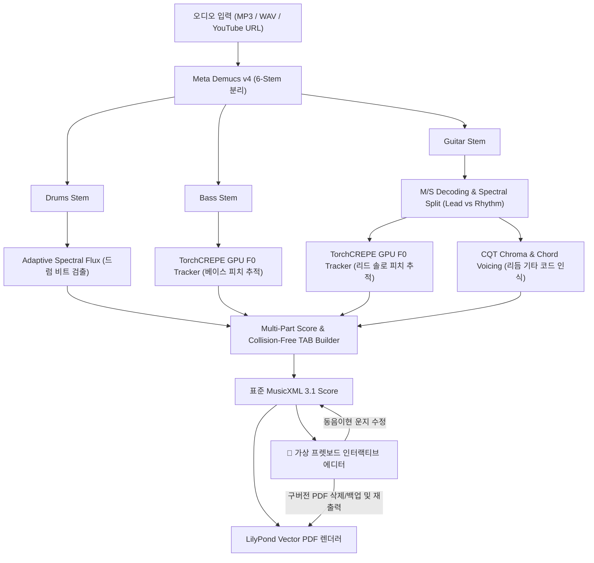

# 🎸 AI Band Transcriber & Interactive Fretboard TAB Editor

<div align="center">

[](https://www.python.org/)
[](https://pytorch.org/)
[](https://github.com/facebookresearch/demucs)
[](https://github.com/maxrmorrison/torchcrepe)
[](https://github.com/TomSchimansky/CustomTkinter)
[](LICENSE)

**음악 파일(MP3/WAV/FLAC) 및 유튜브 링크를 입력받아 AI로 밴드 악기(드럼, 베이스, 리듬/리드 기타)를 분리하고, 고정밀 타브(TAB) 악보 및 MusicXML/PDF를 자동 생성하며, 가상 프렛보드에서 동음이현 대안 운지를 실시간으로 수정할 수 있는 All-in-One 로컬 데스크톱 애플리케이션입니다.**

An end-to-end AI music transcription suite that isolates band instruments (Drums, Bass, Rhythm/Lead Guitar) from audio or YouTube, performs SOTA pitch and chord recognition, exports professional MusicXML & PDF TAB scores, and provides an interactive virtual fretboard editor for alternate fingering adjustments.

</div>

---

## 📸 스크린샷 (Screenshots)

### 1. 세련된 다크모드 GUI & 올인원 워크플로우
> 반응형 스크롤 레이아웃과 도킹 컨트롤러를 지원하며, 원클릭으로 악보 분리, MuseScore 연동, PDF 뷰어, 타브 운지 수정기를 실행할 수 있습니다.

<div align="center">
  
</div>

---

### 2. 고정밀 기타/베이스 타브(TAB) 악보 자동 생성 결과
> TorchCREPE GPU 피치 추적과 CQT 코드 인식을 통해 옥타브 점핑 없이 정밀하게 채보된 실제 악보 (LilyPond 벡터 PDF 렌더링).

<div align="center">
  
</div>

---

### 3. 인터랙티브 가상 프렛보드 운지 편집기 (Alternative Fingering Editor)
> 22프렛 가상 프렛보드에서 선택한 음표의 **동음이현(동일한 음이 나는 다른 줄과 프렛)** 위치를 실시간으로 탐색하고 클릭 한 번으로 운지를 교체하여 즉시 PDF로 재출력할 수 있습니다.

<div align="center">
  
</div>

---

## 🌟 주요 특징 (Key Features)

### 1. 🎧 Meta Demucs v4 기반 6-Stem 고속 음원 분리
- 보컬, 드럼, 베이스, 기타, 피아노, 기타 배킹 트랙을 GPU(CUDA) 가속으로 고음질 분리.
- Mid-Side(M/S) 디코딩 및 스펙트럴 분리를 통해 센터 솔로(Lead Guitar)와 스테레오 더블트래킹 백킹(Rhythm Guitar)을 정밀하게 개별 분리.

### 2. 🧠 SOTA TorchCREPE GPU 피치 추적 & CQT 코드 인식 (Plan A 엔진)
- **TorchCREPE 심층 신경망**: 360-bin Viterbi 디코딩으로 저음역(베이스) 및 고음역(기타 솔로)의 옥타브 건너뜀(Octave Jump)과 고스트 노트를 완벽 차단.
- **CQT Chroma 기타 코드 인식**: 리듬 기타 트랙의 CQT 스펙트로그램으로부터 표준 6현 기타 코드 보이싱(Open/Barre Voicing)을 자동 매핑.
- **충돌 방지(Collision-free) 현 할당**: 화음 구성음 간 동일 줄 충돌을 자동 회피하여 실제 연주 가능한 타브 운지 계산.

### 3. 🎸 실시간 인터랙티브 프렛보드 에디터 (`src/fretboard_gui.py`)
- **22프렛 가상 기타/베이스 지판 제공**: 마디 및 음표 선택 시 지판 위에 현재 위치 및 모든 대안 운지(동음이현)가 하이라이트.
- **클릭 한 번으로 운지 변경**: 연주하기 불편한 포지션을 원하는 현/프렛으로 즉시 수정.
- **스마트 PDF 갱신 & 이전 버전 관리**: 악보 수정 후 PDF 재출력 시, 이전 구버전 PDF를 깔끔하게 삭제할지 또는 타임스탬프 백업으로 안전 보존할지 선택 가능.

### 4. 📄 무결점 MusicXML & 벡터 PDF 자동 출력
- **MuseScore 4 / Guitar Pro / TuxGuitar 호환**: 표준 MusicXML 3.1 포맷 지원.
- **LilyPond 내장 변환 엔진**: 복잡한 타브 표기 및 쉼표(Rest) 정규화를 거쳐 인쇄 품질의 고해상도 벡터 PDF 자동 생성.

### 5. 🖥️ 간편한 Windows 데스크톱 경험
- **경량 런처 (`AI_Band_Transcriber.exe`)**: C# 네이티브 래퍼로 콘솔창 깜빡임 없이 즉시 실행.
- **유튜브 링크 직접 지원**: URL 입력만으로 `yt-dlp`가 고음질 오디오를 자동 다운로드하여 파이프라인 직행.
- **이전 작업 악보 자동 복원**: 프로그램을 재실행해도 가장 최근에 생성한 악보와 폴더를 즉시 감지하여 버튼 자동 활성화.
- **파트 선택 출력**: 드럼 / 베이스 / 리듬 기타 / 리드 기타 중 필요한 파트만 선별하여 악보 제작 가능.

---

## 🔄 시스템 아키텍처 (System Architecture)



---

## 💻 요구 사양 및 필수 사전 준비 (Prerequisites)

### 1. 하드웨어 및 운영체제
- **OS**: Windows 10 / 11 (64-bit 권장)
- **CPU**: 4코어 이상 권장
- **GPU (강력 권장 ⭐)**: NVIDIA 그래픽카드 (CUDA 11.8 또는 12.x 지원, VRAM 4GB 이상)
  - *GPU가 없어도 CPU로 실행 가능하지만 처리 시간이 약 5~10배 더 소요될 수 있습니다.*
- **RAM**: 최소 8GB (16GB 이상 권장)

### 2. 필수 외부 유틸리티 (1분 간편 설치)
Windows 터미널(PowerShell)에서 `winget`을 통해 손쉽게 설치할 수 있습니다:

```powershell
# 1. FFmpeg 설치 (오디오 스트림 분리 및 yt-dlp 다운로드 필수)
winget install Gyan.FFmpeg

# 2. LilyPond 설치 (벡터 PDF 타브 악보 자동 생성 엔진)
winget install LilyPond.LilyPond

# 3. MuseScore 4 설치 (선택 권장: 생성된 MusicXML 악보 열람 및 실시간 연주 재생)
winget install UltimateGuitar.MuseScore
```
> [!TIP]
> `winget`으로 설치한 뒤에는 터미널(PowerShell) 창을 새로 열어야 환경 변수(PATH)가 정상 적용됩니다.

---

## 🚀 상세 설치 가이드 (Step-by-Step Installation)

### 1. 저장소 복제 (Clone Repository)
PowerShell 또는 Git Bash를 열고 원하는 폴더에서 다음을 입력합니다:
```powershell
git clone https://github.com/ManofKimchi08/ai-guitar-transcriber.git
cd ai-guitar-transcriber
```

### 2. 가상환경 생성 및 활성화
Python 3.10 또는 3.11 환경을 권장합니다:
```powershell
python -m venv venv
.\venv\Scripts\Activate.ps1
```
*(PowerShell 스크립트 실행 보안 오류 발생 시: `Set-ExecutionPolicy -Scope Process -ExecutionPolicy Bypass` 입력)*

### 3. PyTorch (CUDA 가속 버전) 설치
사용 중인 그래픽카드에 맞는 PyTorch를 설치합니다 (NVIDIA GPU 권장):
```powershell
# NVIDIA CUDA 12.4 가속 버전 (대부분의 최신 RTX/GTX 그래픽카드)
pip install torch torchaudio --index-url https://download.pytorch.org/whl/cu124

# 또는 CPU 전용 버전 (NVIDIA 그래픽카드가 없는 경우)
# pip install torch torchaudio
```

### 4. 필수 라이브러리 일괄 설치
```powershell
pip install -r requirements.txt
```

---

## 📖 상세 사용 방법 (User Manual)

### 1. 프로그램 실행

#### 방법 A: 초간편 원클릭 실행 (Windows 추천 ⭐)
프로젝트 폴더 내의 **`AI_Band_Transcriber.exe`** 또는 **`run_gui.bat`** 파일을 더블 클릭하면 자동으로 가상환경을 불러와 다크모드 GUI가 실행됩니다.

#### 방법 B: 터미널 직접 실행
```powershell
.\venv\Scripts\python.exe app_gui.py
```

---

### 2. GUI 화면 사용 단계

```
┌────────────────────────────────────────────────────────┐
│  🎸 AI Band Transcriber                                │
├────────────────────────────────────────────────────────┤
│  [1] 음원 입력: 파일 선택 (.mp3/.wav) 또는 유튜브 URL  │
│  [2] 악보 스타일: 타브 악보(TAB) / 오선보 / 둘 다      │
│  [3] 파트 선택: ☑드럼  ☑베이스  ☑리듬기타  ☑리드기타   │
│  [4] 🚀 악보 및 타브 생성 시작 (원클릭 변환)          │
├────────────────────────────────────────────────────────┤
│  [5] 하단 액션 버튼:                                   │
│      📁 결과 폴더 열기   🎼 MuseScore로 열기            │
│      📄 PDF 악보 열기    🎸 타브 운지 수정 (Editor)     │
└────────────────────────────────────────────────────────┘
```

#### Step 1: 음원 입력
- **로컬 음악 파일**: `[파일 찾기...]` 버튼을 눌러 컴퓨터에 보관된 MP3, WAV, FLAC 등의 오디오 파일을 선택합니다.
- **유튜브 링크**: 입력창에 유튜브 URL(`https://www.youtube.com/watch?v=...`)을 붙여넣으면 고음질 오디오가 자동으로 다운로드되어 악보화 파이프라인으로 직행합니다.

#### Step 2: 옵션 설정
- **악보 출력 스타일**:
  - `타브 악보 (TAB)`: 기타/베이스 연주자를 위한 숫자 운지 타브 악보 (기본값)
  - `오선보 (Standard)`: 일반 음표 오선보
  - `오선보 + 타브 둘 다 (Both)`: 상단 오선보 + 하단 타브 악보를 나란히 배치한 완성형 악보
- **악보 포함 파트 선택 (체크박스)**:
  - 🥁 **드럼**: 킥/스네어/하이햇 비트 악보화
  - 🎸 **베이스 기타**: 저음역 4현 타브 악보
  - 🎸 **리듬 기타**: 백킹 코드 화음 6현 타브 악보
  - 🎸 **리드 기타**: 멜로디 및 솔로 6현 타브 악보
  *(필요한 파트만 체크하여 솔로 악보나 특정 악기 악보만 단독 생성 가능)*

#### Step 3: 변환 시작
- `[🚀 악보 및 타브 생성 시작]` 버튼을 클릭합니다.
- 하단 로그 창에서 **음원 6-stem 분리 ➡️ 기타 M/S 분리 ➡️ TorchCREPE GPU 피치 추적 ➡️ CQT 코드 인식 ➡️ 타브 악보 및 PDF 생성** 단계가 실시간으로 표시됩니다.

#### Step 4: 결과물 확인
변환이 끝나면 하단 도킹 버튼들이 즉시 활성화됩니다:
- **`📁 결과 폴더 열기`**: 분리된 무손실 오디오 트랙(`output/stems/`), 악기별 MIDI 파일(`output/midi/`), MusicXML 및 PDF 악보(`output/scores/`)를 윈도우 탐색기로 바로 엽니다.
- **`🎼 MuseScore / 악보 프로그램으로 열기`**: MuseScore 4 등 악보 프로그램으로 즉시 연동하여 실시간 재생 및 추가 편집을 수행합니다.
- **`📄 PDF 악보 열기`**: 인쇄 품질의 고해상도 벡터 PDF 악보를 기본 뷰어로 열람합니다.

> [!NOTE]
> 프로그램을 종료했다가 나중에 다시 켜더라도, 이전에 만든 가장 최근 악보를 자동으로 감지하여 하단 버튼들이 즉시 활성화됩니다.

---

### 3. 인터랙티브 가상 프렛보드 운지 편집기 (`Fretboard Editor`)

기타나 베이스는 동일한 음정이라도 칠 수 있는 줄과 프렛 위치가 다양(동음이현)합니다. AI가 자동 배치한 운지가 손에 맞지 않거나 연주하기 까다로울 때 직접 손쉽게 수정할 수 있습니다:

1. 하단의 **`[🎸 타브 운지 수정 (Fretboard Editor)]`** 버튼을 누릅니다.
2. 상단 메뉴에서 수정할 **악기 파트**(Lead / Rhythm / Bass)와 **마디 번호**를 선택합니다.
3. 좌측 음표 목록에서 수정하려는 음표를 클릭합니다.
4. **22프렛 가상 프렛보드**에 현재 운지(파란색 원)와 **동일한 음이 나는 모든 대안 위치(초록색 원)** 가 즉시 하이라이트됩니다.
5. 원하는 위치의 원을 클릭하거나 하단의 `[선택]` 버튼을 클릭하면 즉시 운지가 변경됩니다.
6. **`[📄 PDF 즉시 갱신 및 열기]`** 를 누릅니다:
   - **이전 PDF 삭제 여부 팝업**이 표시됩니다:
     - **[예(Yes)]**: 구버전 PDF를 깔끔하게 삭제하고, 방금 수정한 최신 운지로 새 PDF를 생성합니다.
     - **[아니오(No)]**: 구버전 PDF를 잃어버리지 않도록 타임스탬프 백업(`_backup.pdf`)으로 보존하고 새 PDF를 생성합니다.
     - **[취소(Cancel)]**: 작업을 취소하고 편집 상태로 돌아갑니다.

---

### 4. CLI 명령행 배치 변환 (고급 사용자용)

GUI 없이 터미널 명령 한 줄로 다량의 곡을 자동 변환할 수도 있습니다:

```powershell
# 기본 타브 악보 변환
.\venv\Scripts\python.exe main.py -i "input_song.mp3" -o "output" --style tab

# 오선보 + 타브 둘 다 출력
.\venv\Scripts\python.exe main.py -i "input_song.wav" -o "output" --style both
```

---

## ❓ 자주 묻는 질문 (FAQ & Troubleshooting)

**Q1. `CUDA out of memory` (GPU 메모리 부족) 오류가 발생합니다.**  
> 그래픽카드의 VRAM이 부족할 때 발생할 수 있습니다. 백그라운드에서 실행 중인 게임이나 다른 AI 프로그램을 종료해 주시거나, 긴 곡의 경우 3~4분 단위로 잘라서 입력해 보세요.

**Q2. MusicXML 파일은 생성되는데 PDF 파일이 생성되지 않습니다.**  
> 시스템에 LilyPond가 설치되어 있지 않거나 환경 변수에 등록되지 않았을 때 발생합니다. PowerShell에서 `winget install LilyPond.LilyPond`를 실행한 후 터미널 또는 앱을 재시작해 주세요. (PDF가 없더라도 MuseScore로 MusicXML을 열어 [파일 ➡️ 내보내기 ➡️ PDF]로 즉시 저장하실 수도 있습니다.)

**Q3. 유튜브 링크 변환 시 다운로드 오류가 납니다.**  
> 유튜브의 내부 변경에 대응하기 위해 최신 `yt-dlp`로 업데이트해야 합니다:
> ```powershell
> .\venv\Scripts\pip.exe install --upgrade yt-dlp
> ```

**Q4. 바탕화면에 바로가기 아이콘을 만들고 싶습니다.**  
> 프로젝트 폴더 안의 `create_desktop_shortcut.ps1`을 PowerShell에서 마우스 우클릭 ➡️ `PowerShell에서 실행`을 누르면 바탕화면에 바로가기가 자동 생성됩니다.

---

## 📁 프로젝트 구조 (Repository Structure)

```
ai_band_transcriber/
├── app_gui.py                 # CustomTkinter 반응형 다크모드 메인 GUI
├── main.py                    # CLI 파이프라인 진입점
├── AI_Band_Transcriber.exe    # Windows 원클릭 실행 런처
├── Launcher.cs                # 런처 C# 소스 코드
├── run_gui.bat                # 가상환경 자동 로딩 배치 스크립트
├── requirements.txt           # Python 라이브러리 목록
│
├── src/                       # 핵심 오디오 분석 및 채보 엔진
│   ├── separator.py           # Meta Demucs 6-stem 음원 분리
│   ├── guitar_splitter.py     # M/S 기반 Lead / Rhythm 기타 분리
│   ├── pitch_transcriber.py   # TorchCREPE GPU 고정밀 F0 피치 트래커
│   ├── chord_recognizer.py    # CQT 크로마 기반 기타 코드 인식기
│   ├── drum_transcriber.py    # 스펙트럴 플럭스 드럼 트랜스크라이버
│   ├── tab_builder.py         # 충돌 회피 알고리즘 기반 타브 악보 빌더
│   ├── fretboard_editor.py    # MusicXML DOM 운지 변경 및 동음이현 탐색기
│   ├── fretboard_gui.py       # 22프렛 가상 프렛보드 인터랙티브 GUI
│   ├── pdf_exporter.py        # MusicXML to LilyPond / PDF 익스포터
│   └── youtube_downloader.py  # yt-dlp 유튜브 고음질 오디오 다운로더
│
├── docs/                      # 문서 및 스크린샷 에셋
│   └── images/
│       ├── gui_main.png
│       ├── tab_score_preview.png
│       └── fretboard_editor.png
│
└── tests/                     # 단위 테스트 및 검증 스크립트
```

---

## 🏷️ GitHub Topics / Tags

`ai-transcription`, `guitar-tab`, `torchcrepe`, `demucs`, `chord-recognition`, `fretboard-editor`, `musicxml`, `lilypond`, `musescore`, `customtkinter`, `pytorch`, `audio-to-tab`

---

## 📄 라이선스 (License)

본 프로젝트는 MIT License를 따릅니다. 세부 사항은 [LICENSE](LICENSE) 파일을 참조하십시오.
